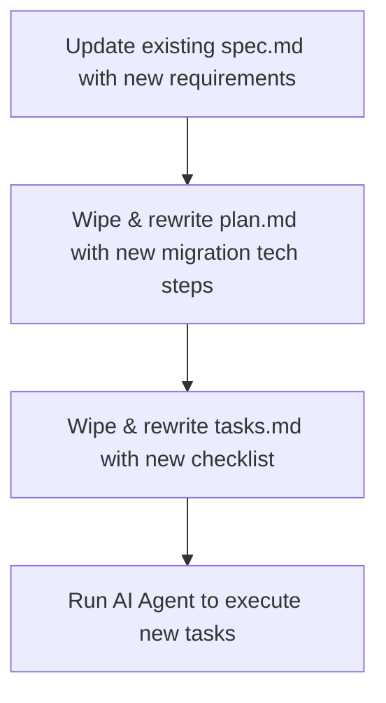

# Spec-Driven Development (SDD) Workflow & Architecture Guide

This document outlines the standard architecture, file structures, and lifecycle workflows for managing an AI-assisted, Spec-Driven Development repository.

---

## 1. Repository Architecture

In SDD, you do not use a single monolithic specification file. Instead, the repository uses a modular, scoped directory structure to constrain the AI's context window, preventing code hallucination and drift.

```text
├── .specify/
│   └── memory/
│       └── constitution.md     # Exactly ONE per project (Global rules)
└── specs/
    ├── 001-user-authentication/
    │   ├── spec.md             # ONE per feature (What to build & why)
    │   ├── plan.md             # ONE per feature (Technical architecture)
    │   └── tasks.md            # ONE per feature (Execution checklist)
    └── 002-payment-gateway/
        ├── spec.md
        ├── plan.md
        └── tasks.md
```

### The Global Level
*   **`constitution.md` (or `CLAUDE.md`)**
    *   **Quantity:** Exactly 1 per project repository.
    *   **Purpose:** Defines global tech stacks, formatting styles, testing strategies, security baselines, and permanent "never do" boundaries.

### The Feature Level (The 1:1:1 Trio Relationship)
Every feature, epic, or major user story requires a dedicated, numbered folder containing exactly three files. If a feature becomes too large, it must be split into sub-features (e.g., `001a` and `001b`) to preserve context limits.

1.  **`spec.md` (The Product Manager):** Outlines user stories, acceptance criteria, UI/UX requirements, and explicit out-of-scope boundaries.
2.  **`plan.md` (The Tech Lead):** Maps requirements directly to the codebase. It details files to create, files to modify, database schema changes, and endpoint structures.
3.  **`tasks.md` (The Engineer):** A linear, step-by-step checklist written for the AI agent or developer to physically tick off (`[x]`) and commit as work progresses.

---

## 2. Feature Update Workflow

When modifying an existing feature, **never create a new folder.** Instead, iterate on the existing feature folder to capture the new "delta" requirements.



1.  **Update `spec.md`:** Add a new section (e.g., `## Update: [Date / Feature Version]`) defining the new requirements.
2.  **Wipe and Rewrite `plan.md`:** Erase the previous implementation plan. Write a fresh plan mapping out how to migrate the *current* codebase to the *new* state.
3.  **Wipe and Rewrite `tasks.md`:** Clear old tasks and write a brand new execution checklist.
4.  **Execute:** Point the AI agent to the updated folder to modify the existing files.

---

## 3. Bug Fixing Workflows

How you handle bugs depends entirely on *when* the bug is discovered.

### Scenario A: Bug Found During Active Implementation
*   **Cause:** The AI drifted from the plan, or the original technical plan contained a logical flaw.
*   **Action:** 
    1. Stop the AI agent runner immediately. **Do not let it guess a fix.**
    2. Roll back or fix the broken files manually if needed.
    3. Update `plan.md` with a corrected technical approach.
    4. Update `tasks.md` with corrective steps to resolve the issue.
    5. Restart the AI agent to let it resume from the corrected plan.

### Scenario B: Bug Found After Implementation (Production/Testing)
*   **Cause:** Edge cases or regressions were missed in the original acceptance criteria.
*   **Action:** Do not modify the original feature folder. Treat the bug as a brand new, scoped mini-feature.
    1. Create a new directory using a bug prefix (e.g., `specs/bug-001-fix-auth-timeout/`).
    2. Generate a new 1:1:1 trio inside that folder:
        *   **`spec.md`:** Describe the buggy behavior vs. the expected behavior.
        *   **`plan.md`:** Target the exact files causing the bug and outline the architectural fix.
        *   **`tasks.md`:** Create a checklist to apply the fix and write a regression test.
    3. Feed the new bug-fix folder to the AI agent.

---

## 4. The Golden Rule: Eliminate Spec Drift

> **"Spec First, Code Second."**

If a human developer or an AI agent modifies the source code without updating or creating a corresponding markdown specification file, you introduce **Spec Drift**. 

When Spec Drift occurs, the markdown documentation loses sync with reality. The next time an AI agent scans your specification directory, it will assume the undocumented code or fixes do not exist, resulting in broken dependencies, overwritten code, and regression bugs. Always keep your specifications updated before writing code.
